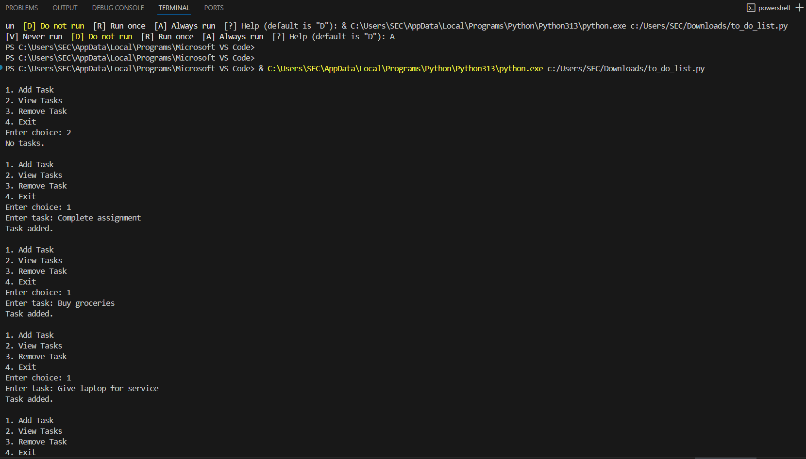
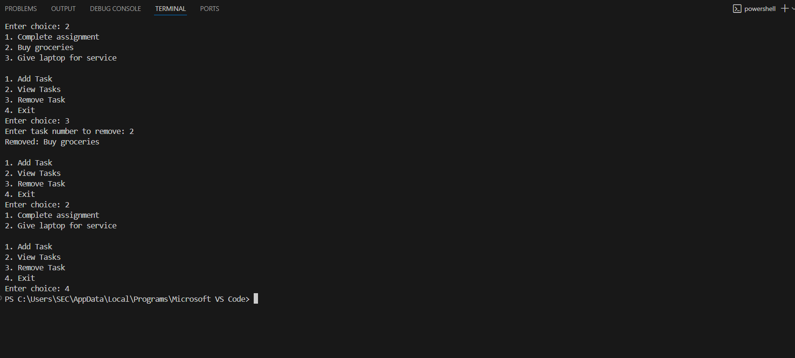

# ToDo_List Application

## Introduction
Built a simple console-based To-Do List application in Python.

It allows users to add, view, mark, and delete tasks.

The project is designed to strengthen my basic Python programming skills and practice list manipulation, loops, and conditionals.

## Features
1. Add new tasks to the list

2. View all existing tasks

3. Mark tasks as complete

4. Delete tasks by number

5. Exit the application

## Technologies Used
- Python 3.8+

- Runs on Command Prompt / VS Code

## Program
```
import os

FILENAME = "tasks.txt"

def load_tasks():
    if os.path.exists(FILENAME):
        with open(FILENAME, "r") as file:
            return [line.strip() for line in file.readlines()]
    return []

def save_tasks(tasks):
    with open(FILENAME, "w") as file:
        for task in tasks:
            file.write(task + "\n")

tasks = load_tasks()

while True:
    print("\n1. Add Task\n2. View Tasks\n3. Remove Task\n4. Exit")
    choice = input("Enter choice: ")

    if choice == "1":
        task = input("Enter task: ")
        tasks.append(task)
        save_tasks(tasks)
        print("Task added.")

    elif choice == "2":
        if not tasks:
            print("No tasks.")
        else:
            for i, task in enumerate(tasks, start=1):
                print(f"{i}. {task}")

    elif choice == "3":
        try:
            num = int(input("Enter task number to remove: "))
            removed = tasks.pop(num - 1)
            save_tasks(tasks)
            print(f"Removed: {removed}")
        except:
            print("Invalid number.")

    elif choice == "4":
        break

    else:
        print("Invalid choice.")
```
## Output Screenshots




## Gained Insights
- Practiced list operations such as append() and pop() in Python.
- Improved loop control and user interaction with input handling.
- Learned basic exception handling using try / except.
- Understood how to design a simple menu-driven program in Python.

## Author
Sneha Basyal
